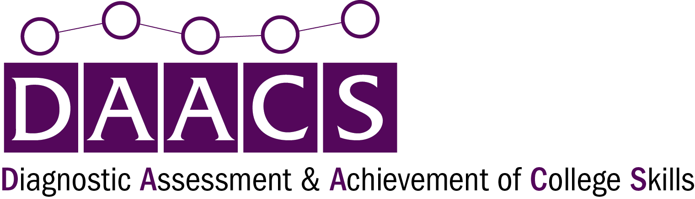

For questions contact Jason Bryer, Ph.D. at [jbryer@excelsior.edu](mailto:jbryer@excelsior.edu).

This website was developed using the [Bootstrapious](https://bootstrapious.com/) theme that was convered to [Hugo](https://gohugo.io/) by [devcows](https://github.com/devcows/hugo-universal-theme). The site is built using the [blogdown](https://github.com/rstudio/blogdown) [R](https://www.r-project.org/) package (see the [`build.R`](build.R) script). Some creative commons images retrieved from [Pexels](https://www.pexels.com/search/education/).

________________________________________________________________________________

*The contents of this website were developed under grant P116F150077 from the U.S. Department of Education. However, those contents do not necessarily represent the policy of the U.S. Department of Education, and you should not assume endorsement by the Federal Government.*

This work is licensed under a [Creative Commons Attribution 4.0 International License](https://creativecommons.org/licenses/by/4.0/).  
The DAACS software is licensed under the [GNU General Public License version 3](https://opensource.org/licenses/GPL-3.0).